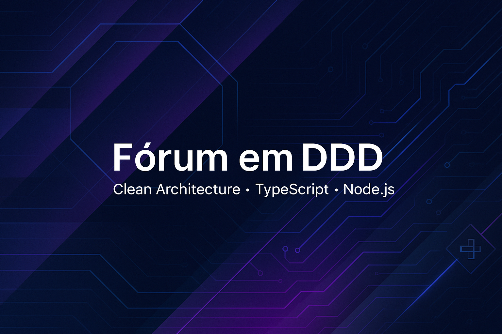

# 🧠 Forum com DDD, Clean-Architecture e SOLID

Um projeto de fórum desenvolvido com foco em Domain-Driven Design (DDD), utilizando Node.js, TypeScript e princípios de Clean Code e SOLID.




## 📚 Sobre o Projeto

Este projeto tem como objetivo a criação de uma aplicação de fórum que segue os princípios do DDD, promovendo uma arquitetura limpa e escalável. A estrutura do projeto é dividida em camadas distintas, facilitando a manutenção e evolução do sistema.

## 🚀 Tecnologias Utilizadas

- **Node.js**: Ambiente de execução JavaScript no servidor.
- **TypeScript**: Superset do JavaScript que adiciona tipagem estática.
- **Jest**: Framework de testes para garantir a qualidade do código.
- **ESLint**: Ferramenta de análise de código para manter padrões consistentes.
- **Prettier**: Formatador de código para manter a consistência de estilo.

## ⚙️ Instalação e Execução

1. **Clone o repositório:**

   ```bash
   git clone https://github.com/Ytalo-Alves/forum_in_DDD.git
   cd forum_in_DDD
   ```

2. **Instale as dependências:**

   ```bash
   npm install
   ```

3. **Configure as variáveis de ambiente:**

   Crie um arquivo `.env` na raiz do projeto com as seguintes variáveis:

   ```env
   DATABASE_URL=your_database_url
   ```

4. **Execute as migrações do banco de dados:**

   ```bash
   npx prisma migrate dev
   ```

5. **Inicie a aplicação:**

   ```bash
   npm run dev
   ```

## ✅ Testes

Para executar os testes automatizados:

```bash
npm run test
```

## 📄 Licença

Este projeto está licenciado sob a [MIT License](LICENSE).
